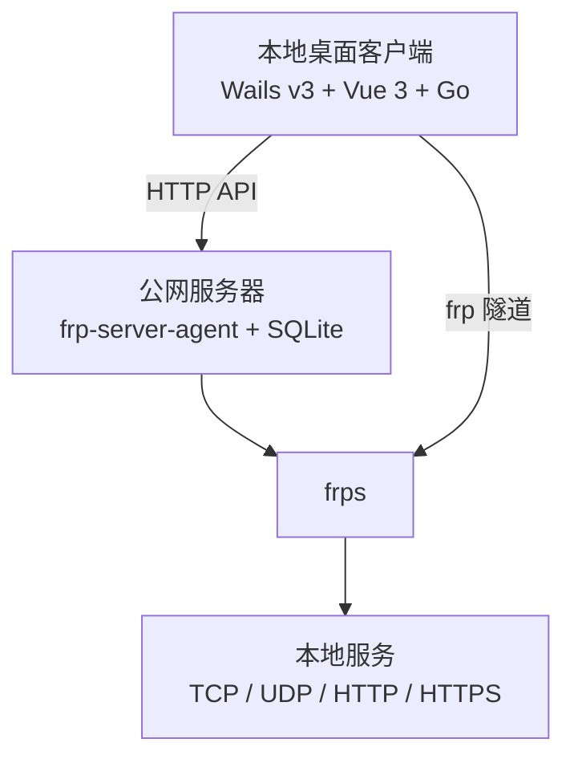

# FRP Manager

基于 [frp](https://github.com/fatedier/frp) 的本地桌面内网穿透管理系统。项目由服务端控制面和本地桌面客户端组成，用户通过客户端管理服务器、隧道和 `frpc` 进程，不提供 Web 管理页面。

> 当前版本：`0.1.0`。客户端使用 Wails v3，开发和构建流程目前以 Windows 为主要验证平台。

## 功能概览

### 客户端

- 管理多个 FRP 服务端连接，并支持设置默认服务器。
- 创建和管理 TCP、UDP、HTTP、HTTPS 隧道。
- 根据服务端能力校验远程端口和域名。
- 自动生成本地 `frpc` 配置并管理 `frpc` 的启动、停止和重启。
- 查看实时运行日志，并按配置持久化日志。
- 支持系统托盘、关闭最小化到托盘、开机自启和单实例运行。
- 使用 SQLite 保存服务器和隧道配置。

### 服务端

- 提供 `frp-server-agent` HTTP API，供客户端进行管理。
- 自动启动并管理 `frps` 进程。
- 读取和校验 `frps` 配置，暴露服务端能力信息。
- 管理 TCP/UDP 远程端口池，支持端口检查、分配和释放。
- 校验和管理 HTTP/HTTPS 域名及子域名。
- 使用 SQLite 保存端口和域名资源。
- 通过 Bearer Token 保护除健康检查之外的 API。

## 系统架构



- 客户端负责用户界面、服务器连接、隧道配置和本地 `frpc` 生命周期。
- 服务端 Agent 负责服务端资源约束和 `frps` 状态管理。
- 客户端与 Agent 之间使用 HTTP API 通信；管理 API 使用 Bearer Token 鉴权。

## 仓库结构

```text
frp-gui/
├── go.work                 # 聚合 client 和 server 两个 Go module
├── client/                 # Wails v3 桌面客户端
│   ├── app.go              # 暴露给前端调用的应用服务
│   ├── main.go             # Wails 应用入口、窗口和托盘初始化
│   ├── internal/           # 数据库、Agent API、frpc、设置和日志模块
│   ├── frontend/           # Vue 3 + TypeScript + Vite 前端
│   └── build/              # Wails 构建配置及平台资源
├── server/                 # 服务端 Agent
│   ├── cmd/agent/          # Agent 入口
│   ├── internal/           # API、配置、frps、端口池、域名和存储模块
│   ├── migrations/         # SQLite 数据库迁移
│   └── configs/            # Agent 和 frps 配置示例
└── docs/                   # 本地开发文档（默认不纳入 Git）
```

## 开发环境

- Go `1.26+`
- Node.js `20+`
- npm `11+`（或兼容的 npm 版本）
- [Wails v3 CLI](https://v3.wails.io/)
- 服务端运行需要可执行的 `frps`；客户端运行需要可用的 `frpc`

安装 Wails v3 CLI：

```powershell
go install github.com/wailsapp/wails/v3/cmd/wails3@latest
```

## 快速开始

### 1. 启动服务端 Agent

复制配置示例并按实际环境修改：

```powershell
cd server
Copy-Item configs/agent.toml.example configs/agent.toml
Copy-Item configs/frps.toml.example configs/frps.toml
```

至少需要确认以下配置：

- `server.addr`：Agent API 监听地址。
- `server.token`：客户端访问 Agent 使用的 Token。
- `server.database`：服务端 SQLite 数据库路径。
- `frps.binary`：`frps` 可执行文件路径。
- `frps.config`：`frps.toml` 配置文件路径。
- `domain.allowed_root_domains`：允许使用的根域名列表。

启动 Agent：

```powershell
go run ./cmd/agent -config configs/agent.toml
```

Agent 默认监听 `127.0.0.1:7400`（示例配置为 `0.0.0.0:7400`）。健康检查接口无需 Token：

```powershell
Invoke-WebRequest http://127.0.0.1:7400/api/health
```

其他 API 需要请求头：

```text
Authorization: Bearer <server-token>
```

### 2. 启动客户端开发模式

先安装前端依赖：

```powershell
cd client/frontend
npm install
```

再启动 Wails 开发模式：

```powershell
cd ..
wails3 dev
```

启动客户端后，在界面中填写服务端 Agent URL、Agent Token、`frps` 地址和 FRP Token，即可添加服务器并创建隧道。

## 构建与打包

### 打包客户端

```powershell
cd client
wails3 package
```

打包产物默认位于 `client/bin/`。

### 构建服务端 Agent

服务端提供 PowerShell 构建脚本，同时生成 Linux AMD64 和 Windows AMD64 版本：

```powershell
cd server
.\build.ps1
```

脚本等价于：

```powershell
$env:GOOS="linux"; $env:GOARCH="amd64"; go build -o bin/agent ./cmd/agent
$env:GOOS="windows"; $env:GOARCH="amd64"; go build -o bin/agent.exe ./cmd/agent
```

## 测试

在仓库根目录执行全部 Go module 测试：

```powershell
go test ./client/... ./server/...
```

也可以分别执行：

```powershell
cd client
go test ./...

cd ..\server
go test ./...
```

## 支持的映射协议

| 协议 | 远程端口 | 域名 | 典型场景 |
| --- | --- | --- | --- |
| TCP | 支持 | 不支持 | SSH、RDP、数据库 |
| UDP | 支持 | 不支持 | WireGuard、游戏、DNS |
| HTTP | 不支持 | 支持 | Web 服务、HTTP API |
| HTTPS | 不支持 | 支持 | HTTPS Web 服务 |

## 配置和数据位置

### 服务端

- Agent 配置：由 `-config` 参数指定，默认是 `configs/agent.toml.example`。
- `frps` 配置：由 Agent 配置中的 `frps.config` 指定。
- 服务端 SQLite：由 `server.database` 指定。
- `frps` 日志：由 `frps.log.to` 或 Agent 的 `frps.log_dir` 相关配置指定。

### 客户端

客户端配置、SQLite 数据库、`frpc` 配置和日志由客户端根据操作系统用户数据目录管理。客户端设置包括日志保留天数、开机自启、关闭到托盘和主题等选项。

## 安全注意事项

- 不要把真实的 Agent Token、FRP Token、域名管理凭据或 `frps` Dashboard 密码提交到 Git。
- 生产环境应使用随机、高强度 Token，并限制 Agent API 的网络访问范围。
- `/api/health` 不需要鉴权，只返回服务健康状态；其余管理 API 必须使用 Bearer Token。
- `frps` Dashboard 默认应仅监听本机地址，不要直接暴露到公网。
- 示例配置中的域名、密码和 Token 仅用于开发，部署前必须替换。

